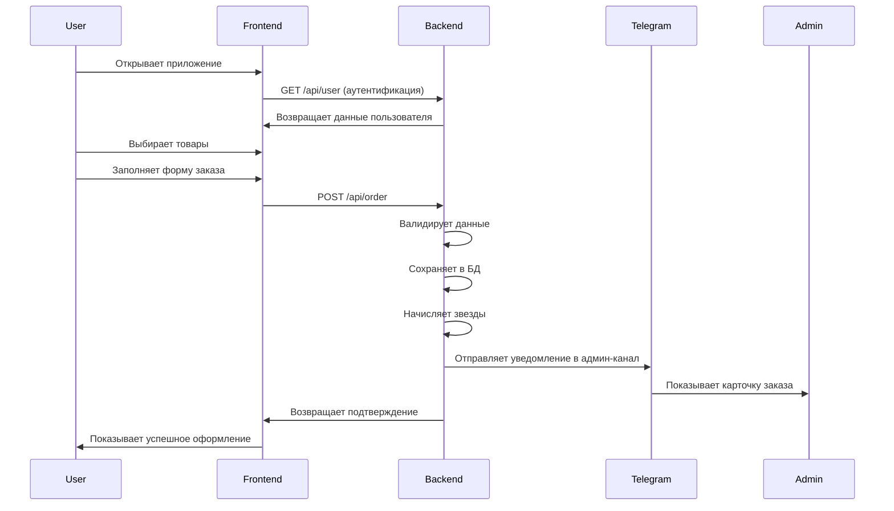

# Willow Coffee — Telegram Mini App

   

Полнофункциональное Telegram Mini App для кофейни с системой заказов, программой лояльности и админ-панелью.

## 🏗️ Архитектура системы

```
┌─────────────────────┐    ┌──────────────────────┐    ┌─────────────────────┐
│   Telegram WebApp   │    │      Backend API     │    │   Admin Channel     │
│  (GitHub Pages)     │◄──►│      (Koyeb)         │───►│   (Telegram)        │
│                     │    │                      │    │                     │
│ • HTML/CSS/JS       │    │ • Express.js         │    │ • Order alerts      │
│ • Menu display      │    │ • PostgreSQL         │    │ • Admin commands    │
│ • Order form        │    │ • Telegram Bot API   │    │ • Real-time updates │
│ • Loyalty system    │    │ • CORS enabled       │    │                     │
└─────────────────────┘    └──────────────────────┘    └─────────────────────┘
            │                         │
            │                         │
            ▼                         ▼
┌─────────────────────┐    ┌──────────────────────┐
│   Google Sheets     │    │    PostgreSQL DB     │
│                     │    │                      │
│ • Dynamic menu      │    │ • Users & cards      │
│ • Multi-language    │    │ • Orders & items     │
│ • Easy updates      │    │ • Transactions       │
│ • CSV export        │    │ • Loyalty stars      │
└─────────────────────┘    └──────────────────────┘
```

## 🚀 Текущее состояние

### ✅ Реализовано и работает:
- **Frontend**: Полностью функциональный интерфейс на GitHub Pages
- **Backend API**: Express.js сервер на Koyeb с полным функционалом
- **Система заказов**: Столики (1-10 + на вынос), ETA (сейчас/10мин/20мин), способы оплаты (наличные/звезды)  
- **Расчет лояльности**: 1 звезда за каждые 350 RSD
- **Тестовый режим**: Работает без настройки Telegram бота
- **Динамическое меню**: Загружается из Google Sheets
- **Мультиязычность**: EN/RU/SR

### ⚙️ Требует настройки для продакшена:
- **BOT_TOKEN**: Токен Telegram бота (от @BotFather)
- **ADMIN_CHANNEL_ID**: ID канала для уведомлений о заказах
- **DATABASE_URL**: PostgreSQL для продакшена (опционально)
- **Google Sheets**: Сделать таблицу публичной

## 🛠️ Технологический стек

| Компонент | Технология | Хостинг | Состояние |
|-----------|------------|---------|-----------|
| **Frontend** | HTML/CSS/JS + Telegram WebApp SDK | GitHub Pages | ✅ Готов |
| **Backend** | Express.js + Node.js | Koyeb | ✅ Развернут |
| **База данных** | PostgreSQL (prod) / Mock data (test) | Koyeb (встроенная) | ✅ Настроена |
| **Меню** | Google Sheets CSV | Google Drive | ⚠️ Нужен публичный доступ |
| **Бот** | Telegram Bot API | - | ⚠️ Нужна настройка |

## 📋 Возможности системы

### Для клиентов:
- 🍽️ **Просмотр меню** с ценами на 3 языках
- 🛒 **Корзина заказов** с выбором столика и времени
- ⭐ **Программа лояльности** (1 звезда = 350 RSD)
- 🎁 **Обмен звезд** на награды (кофе, завтрак, etc.)
- 💳 **Способы оплаты**: наличные или звезды
- 📱 **Telegram интеграция** с уведомлениями

### Для администраторов:
- 📢 **Автоматические уведомления** о новых заказах
- 📊 **Детальная информация**: клиент, столик, состав заказа, сумма
- ⚡ **Админ команды** в Telegram канале
- 🔄 **Обновление меню** через Google Sheets
- 📈 **Управление лояльностью** пользователей

## 🌐 Ссылки

| Ресурс | URL | Статус |
|--------|-----|--------|
| **Frontend** | https://raz-ar.github.io/willow-mini-app/ | ✅ Активен |
| **Backend API** | https://mild-lotta-willow-2025-1b544553.koyeb.app | ✅ Активен |
| **Menu API** | https://mild-lotta-willow-2025-1b544553.koyeb.app/api/menu | ✅ Активен |
| **Health Check** | https://mild-lotta-willow-2025-1b544553.koyeb.app/health | ✅ Активен |
| **Google Sheets** | [Menu Table](https://docs.google.com/spreadsheets/d/1BRQuzea6bba0NxxPk9koLSzpHkfiAzrKmwDa8ow7128/) | ⚠️ Приватная |

## 🔧 API Endpoints

### Публичные
```
GET  /health              - Проверка состояния сервера
GET  /api/menu            - Получение меню из Google Sheets
POST /api/user            - Аутентификация/создание пользователя  
POST /api/order           - Создание заказа
POST /api/redeem          - Обмен звезд на награды
```

### Webhook
```
POST /tg/webhook          - Telegram Bot webhook
```

## 🚀 Быстрый запуск

### Тестирование (без настройки бота):
1. Открой https://raz-ar.github.io/willow-mini-app/
2. Добавь товары в корзину
3. Выбери столик и способ оплаты
4. Оформи заказ

### Полная настройка:

#### 1. Создай Telegram бота
```bash
# Напиши @BotFather в Telegram
/newbot
# Следуй инструкциям, получи BOT_TOKEN
```

#### 2. Настрой переменные в Koyeb
Зайди в [панель Koyeb](https://app.koyeb.com) → твой сервис → Settings → Environment:
```
BOT_TOKEN=1234567890:ABCdefGHIjklMNOpqrsTUVwxyz
ADMIN_CHANNEL_ID=-4988316360
DATABASE_URL=postgresql://... (опционально для продакшена)
```

#### 3. Настрой Telegram бота
```bash
# Установи webhook
curl "https://api.telegram.org/bot<BOT_TOKEN>/setWebhook?url=https://mild-lotta-willow-2025-1b544553.koyeb.app/tg/webhook"

# Настрой WebApp
curl -X POST "https://api.telegram.org/bot<BOT_TOKEN>/setChatMenuButton" \
-H "Content-Type: application/json" \
-d '{
  "menu_button": {
    "type": "web_app",
    "text": "☕ Willow Coffee", 
    "web_app": {"url": "https://raz-ar.github.io/willow-mini-app/"}
  }
}'
```

#### 4. Добавь бота в админ-канал
1. Добавь бота как администратора в канал
2. Дай права на отправку сообщений

## 📊 Структура базы данных

```sql
-- Пользователи и карты лояльности
users (telegram_id, first_name, last_name, username, stars, card_number, created_at)

-- Заказы
orders (id, short_id, user_id, total_amount, stars_added, eta_minutes, due_at, status, created_at)

-- Позиции заказов  
order_items (id, order_id, item_id, quantity, unit_price, created_at)

-- Транзакции звезд
transactions (id, user_id, type, stars_change, order_id, description, created_at)

-- Награды программы лояльности
rewards (key, cost_stars, name_en, name_ru, name_sr, description, active)
```

## 🔄 Процесс заказа



## 🐛 Отладка и логи

### Проверка API:
```bash
# Проверка здоровья сервера
curl https://mild-lotta-willow-2025-1b544553.koyeb.app/health

# Проверка меню
curl https://mild-lotta-willow-2025-1b544553.koyeb.app/api/menu

# Тестовый заказ
curl -X POST https://mild-lotta-willow-2025-1b544553.koyeb.app/api/order \
  -H "Content-Type: application/json" \
  -d '{
    "initData": "test",
    "items": [{"id": "item-234bbf05", "qty": 1}],
    "eta_minutes": 10,
    "table_number": "1",
    "payment_method": "cash"
  }'
```

### Логи Koyeb:
Проверь логи в панели Koyeb → твой сервис → Logs

## 🔮 Планы развития

### Следующие фичи:
- [ ] Статистика заказов и аналитика
- [ ] Система скидок и промокодов  
- [ ] Push-уведомления о готовности заказа
- [ ] Интеграция с системами оплаты
- [ ] Мобильное приложение (React Native)
- [ ] Система отзывов и рейтингов
- [ ] Управление запасами и остатками

### Технические улучшения:
- [ ] Миграция на TypeScript
- [ ] Unit и интеграционные тесты
- [ ] CI/CD pipeline
- [ ] Monitoring и alerting
- [ ] Backup и disaster recovery
- [ ] Load balancing для высоких нагрузок

## 👥 Участники проекта

- **Архитектура и разработка**: Claude Code AI
- **Продуктовые требования**: Владелец кофейни
- **Дизайн**: Минималистичный UI в стиле Telegram

## 📄 Лицензия

Проект разработан для частного использования кофейни Willow Coffee.

---

**🔗 Репозиторий**: https://github.com/RAZ-AR/willow-mini-app  
**📱 Приложение**: https://raz-ar.github.io/willow-mini-app/  
**⚡ API**: https://mild-lotta-willow-2025-1b544553.koyeb.app

*Последнее обновление: 29 августа 2025*