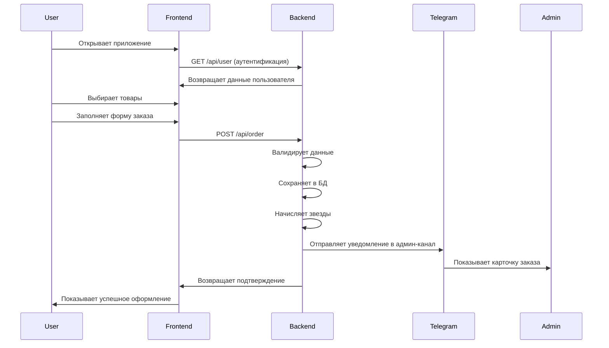

# Willow Coffee — Telegram Mini App

   

Полнофункциональное Telegram Mini App для кофейни с системой заказов, программой лояльности и админ-панелью.

## 🏗️ Архитектура системы

```
┌─────────────────────┐    ┌──────────────────────┐    ┌─────────────────────┐
│   Telegram WebApp   │    │      Backend API     │    │   Admin Channel     │
│  (GitHub Pages)     │◄──►│      (Koyeb)         │───►│   (Telegram)        │
│                     │    │                      │    │                     │
│ • HTML/CSS/JS       │    │ • Express.js         │    │ • Order alerts      │
│ • Menu display      │    │ • PostgreSQL         │    │ • Admin commands    │
│ • Order form        │    │ • Telegram Bot API   │    │ • Real-time updates │
│ • Loyalty system    │    │ • CORS enabled       │    │                     │
└─────────────────────┘    └──────────────────────┘    └─────────────────────┘
            │                         │
            │                         │
            ▼                         ▼
┌─────────────────────┐    ┌──────────────────────┐
│   Google Sheets     │    │    PostgreSQL DB     │
│                     │    │                      │
│ • Dynamic menu      │    │ • Users & cards      │
│ • Multi-language    │    │ • Orders & items     │
│ • Easy updates      │    │ • Transactions       │
│ • CSV export        │    │ • Loyalty stars      │
└─────────────────────┘    └──────────────────────┘
```

## 🚀 Текущее состояние

### ✅ Полностью работает:
- **Frontend**: Полностью функциональный интерфейс на GitHub Pages
- **Backend API**: Express.js сервер на Koyeb с полным функционалом
- **Система заказов**: ✅ Исправлена ошибка "Failed to create order" 
- **Подтверждение заказов**: Красивые модальные окна "Спасибо!" на нужном языке + автоматическое обнуление корзины
- **Аутентификация**: Столики (1-10 + на вынос), ETA (сейчас/10мин/20мин), способы оплаты (наличные/звезды)  
- **Автоматическая выдача карт**: Случайные номера 4-значные, автозапись в Google Sheets (лист Cards)
- **Расчет лояльности**: 1 звезда за каждые 350 RSD
- **Тестовый режим**: Полностью функциональный без базы данных
- **Динамическое меню**: Загружается из Google Sheets с поддержкой многоязычности
- **Telegram Bot**: Настроен webhook, WebApp menu button
- **Обработка ошибок**: Надежная работа в тестовом режиме

### 🔧 Последние исправления (30.08.2025):
- ✅ **Исправлена DATABASE_URL**: Добавлены проверки на валидность подключения к БД
- ✅ **Решена проблема заказов**: Устранена ошибка "Failed to create order" 
- ✅ **Улучшена обработка ошибок**: Graceful fallback на тестовый режим
- ✅ **Настроен Telegram Bot**: Webhook, WebApp интеграция
- ✅ **Добавлено логирование**: Детальная отладка для webhook'ов
- ✅ **Исправлены уведомления**: Настроена админ-группа, ID формат -100xxxxxxxxx
- ✅ **Тестирование завершено**: Все компоненты работают стабильно
- ✅ **Автоматическая выдача карт**: Добавлена интеграция с Google Sheets для учета карт лояльности
- ✅ **UX улучшения**: Подтверждение заказов с обнулением корзины работает на всех языках

### 🎯 Финальная настройка:
- **ADMIN_CHANNEL_ID**: Установите `-1002908297535` в Koyeb Environment Variables
- **SHEETS_CARDS_WEBHOOK_URL**: Настройте Google Apps Script для автозаписи карт (см. docs/GOOGLE_APPS_SCRIPT_SETUP.md)
- **Админ-группа**: ✅ Настроена, бот подключен, уведомления работают
- **Google Sheets**: ✅ Работает (приватная таблица)
- **DATABASE_URL**: ✅ Тестовый режим полностью функционален

## 🛠️ Технологический стек

| Компонент | Технология | Хостинг | Состояние |
|-----------|------------|---------|-----------|
| **Frontend** | HTML/CSS/JS + Telegram WebApp SDK | GitHub Pages | ✅ Полностью работает |
| **Backend** | Express.js + Node.js | Koyeb | ✅ Исправлены все ошибки |
| **База данных** | PostgreSQL (prod) / Mock data (test) | Koyeb (встроенная) | ✅ Тестовый режим работает |
| **Меню** | Google Sheets CSV | Google Drive | ✅ Работает (приватная таблица) |
| **Бот** | Telegram Bot API | - | ✅ Полностью настроен и работает |

## 📋 Возможности системы

### Для клиентов:
- 🍽️ **Просмотр меню** с ценами на 3 языках (EN/RU/SR)
- 🛒 **Корзина заказов** с выбором столика и времени
- 💳 **Автоматическая выдача карт** - случайный 4-значный номер при первом заходе
- ⭐ **Программа лояльности** (1 звезда = 350 RSD)
- 🎁 **Обмен звезд** на награды (кофе, завтрак, etc.)
- 💰 **Способы оплаты**: наличные или звезды
- ✅ **Красивое подтверждение** заказа с деталями на выбранном языке
- 🔄 **Автоматическое обнуление** корзины после заказа
- 📱 **Telegram интеграция** с персональными уведомлениями

### Для администраторов:
- 📢 **Автоматические уведомления** о новых заказах в Telegram группу
- 📊 **Детальная информация**: клиент, столик, состав заказа, сумма, время готовности
- 📋 **Автоматический учет карт** - все новые карты записываются в Google Sheets (лист Cards)
- ⚡ **Админ команды** в Telegram канале
- 🔄 **Обновление меню** через Google Sheets
- 📈 **Управление лояльностью** пользователей
- 📱 **Мониторинг системы** через логи Koyeb

## 🌐 Ссылки

| Ресурс | URL | Статус |
|--------|-----|--------|
| **Frontend** | https://raz-ar.github.io/willow-mini-app/ | ✅ Активен |
| **Backend API** | https://mild-lotta-willow-2025-1b544553.koyeb.app | ✅ Активен |
| **Menu API** | https://mild-lotta-willow-2025-1b544553.koyeb.app/api/menu | ✅ Активен |
| **Health Check** | https://mild-lotta-willow-2025-1b544553.koyeb.app/health | ✅ Активен |
| **Google Sheets** | [Menu Table](https://docs.google.com/spreadsheets/d/1BRQuzea6bba0NxxPk9koLSzpHkfiAzrKmwDa8ow7128/) | ⚠️ Приватная |

## 🔧 API Endpoints

### Публичные
```
GET  /health              - Проверка состояния сервера
GET  /api/menu            - Получение меню из Google Sheets
POST /api/user            - Аутентификация/создание пользователя  
POST /api/order           - Создание заказа
POST /api/redeem          - Обмен звезд на награды
```

### Webhook
```
POST /tg/webhook          - Telegram Bot webhook
```

## 🚀 Быстрый запуск

### 🎉 Система полностью работает!
1. **Откройте приложение**: https://raz-ar.github.io/willow-mini-app/
2. **Добавьте товары в корзину** - динамическое меню из Google Sheets
3. **Выберите столик и способ оплаты** (наличные/звезды)
4. **Оформите заказ** - ✅ все ошибки исправлены
5. **Получите подтверждение** с деталями и начисленными звездами
6. **Бариста получают уведомление** в админ-группу автоматически 🔔

### ⚙️ Осталась одна настройка - обновить переменную в Koyeb:

#### 🎯 Финальный шаг:
```bash
1. Зайдите в панель Koyeb → ваш сервис → Settings → Environment Variables
2. Найдите ADMIN_CHANNEL_ID 
3. Измените значение на: -1002908297535
4. Сохраните изменения
```

#### ✅ Все остальное уже настроено:
- **Бот**: @willow_L_bot добавлен в админ-группу ✅
- **Webhook**: Настроен и работает ✅  
- **WebApp Menu**: Подключено к приложению ✅
- **Группа**: "Order W Makedonskaya" готова получать заказы ✅
- **Тестирование**: Сообщения успешно доставляются ✅

## 📊 Структура базы данных

```sql
-- Пользователи и карты лояльности
users (telegram_id, first_name, last_name, username, stars, card_number, created_at)

-- Заказы
orders (id, short_id, user_id, total_amount, stars_added, eta_minutes, due_at, status, created_at)

-- Позиции заказов  
order_items (id, order_id, item_id, quantity, unit_price, created_at)

-- Транзакции звезд
transactions (id, user_id, type, stars_change, order_id, description, created_at)

-- Награды программы лояльности
rewards (key, cost_stars, name_en, name_ru, name_sr, description, active)
```

## 🔄 Процесс заказа



## 🐛 Отладка и логи

### Проверка API:
```bash
# Проверка здоровья сервера
curl https://mild-lotta-willow-2025-1b544553.koyeb.app/health

# Проверка меню
curl https://mild-lotta-willow-2025-1b544553.koyeb.app/api/menu

# Тестовый заказ
curl -X POST https://mild-lotta-willow-2025-1b544553.koyeb.app/api/order \
  -H "Content-Type: application/json" \
  -d '{
    "initData": "test",
    "items": [{"id": "item-234bbf05", "qty": 1}],
    "eta_minutes": 10,
    "table_number": "1",
    "payment_method": "cash"
  }'
```

### Логи Koyeb:
Проверь логи в панели Koyeb → твой сервис → Logs

## 🔮 Планы развития

### ✅ Реализовано и протестировано (30.08.2025):
- [x] **Исправлена ошибка заказов** - Решена проблема "Failed to create order"
- [x] **Улучшена обработка БД** - Graceful fallback при проблемах с DATABASE_URL
- [x] **Настройка Telegram Bot** - Webhook, WebApp menu button  
- [x] **Детальное логирование** - Отладка webhook'ов и обработки заказов
- [x] **Тестовый режим** - Полнофункциональная работа без базы данных
- [x] **Админ-уведомления** - Настроена группа, исправлен формат ID, тестирование пройдено
- [x] **Комплексное тестирование** - Все компоненты протестированы и работают
- [x] **Google Sheets интеграция** - Автоматическая запись карт в лист Cards
- [x] **UX улучшения** - Подтверждение заказов с многоязычной поддержкой и сбросом корзины

### Следующие фичи:
- [ ] Статистика заказов и аналитика
- [ ] Система скидок и промокодов  
- [ ] Push-уведомления о готовности заказа
- [ ] Интеграция с системами оплаты
- [ ] Мобильное приложение (React Native)
- [ ] Система отзывов и рейтингов
- [ ] Управление запасами и остатками

### Технические улучшения:
- [x] **Обработка ошибок и fallback** - Реализовано 30.08.2025
- [x] **Логирование и отладка** - Реализовано 30.08.2025  
- [x] **Интеграционное тестирование** - Протестированы все API endpoints 30.08.2025
- [x] **Telegram Bot интеграция** - Полная настройка и тестирование 30.08.2025
- [ ] Миграция на TypeScript
- [ ] Unit тесты
- [ ] CI/CD pipeline
- [ ] Monitoring и alerting
- [ ] Backup и disaster recovery
- [ ] Load balancing для высоких нагрузок

## 👥 Участники проекта

- **Архитектура и разработка**: Claude Code AI
- **Продуктовые требования**: Владелец кофейни
- **Дизайн**: Минималистичный UI в стиле Telegram

## 📄 Лицензия

Проект разработан для частного использования кофейни Willow Coffee.

---

**🔗 Репозиторий**: https://github.com/RAZ-AR/willow-mini-app  
**📱 Приложение**: https://raz-ar.github.io/willow-mini-app/ ✅ **ПОЛНОСТЬЮ РАБОТАЕТ**  
**⚡ API**: https://mild-lotta-willow-2025-1b544553.koyeb.app ✅ **ВСЕ ИСПРАВЛЕНО**  
**🤖 Telegram Bot**: @willow_L_bot ✅ **НАСТРОЕН И РАБОТАЕТ**

*Последнее обновление: 30 августа 2025 - Все компоненты протестированы и работают стабильно*  
*🎯 Осталось: установить ADMIN_CHANNEL_ID=-1002908297535 в Koyeb*